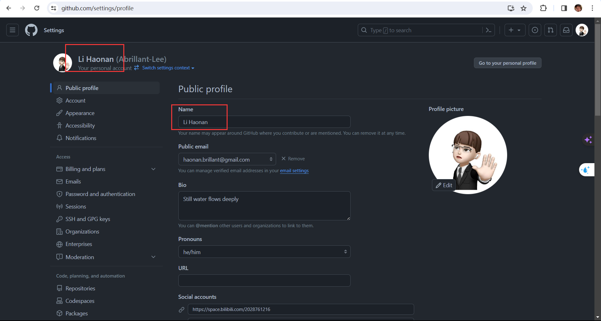

# Tutorial-for-Dummies
> Git日常维护傻瓜式流程

# 1、培训前注意:

1、将自己Github的对外用户名改为自己姓名的拼音，便于识别

  

# 2、创建团队内仓库

- 进入IoT组织--->点击Repositorie-->点击New Repositories

    

- 输入新建仓库的参数信息，
   - 仓库名："团队英文名简称-个人姓名拼音"<br>
   - 仓库简介："团队中文名-个人中文姓名"
   - 点击 "Public"（公开仓库）
   - 点击 "Add a README file"（创建仓库介绍文件）
   - Creat repository (创建仓库)

  - 示例截图

       


- 进入IoT组织--->点击Teams--->点击个人所在的团队

    

- 点击Repositories

    

- 将组织仓库添加到团队内

    

- 完成示例
    

# 3、维护仓库

- 将仓库克隆到本地

  ```ps
  #打开powershell
  win + s ， 输入powerhsell ，点击即可进入

  #进入电脑桌面
  cd Desktop

  #使用仓库的url克隆仓库，url通过下图方式获取
  git clone repository_url
  ```
  

   成功示例

  

- 开始工作

  ```ps
  #进入仓库
  cd SCT-LiHaonan

  #查看本地仓库内容
  ls

  #工作内容省略
  ......
  ```
  成功示例

  

- 更新仓库

  ```ps
  # 添加所有改动到暂存区
  git add .

  # 提交暂存区的改动到本地仓库，""内填写提交信息
  git commit -m ""

  # 将本地仓库的改动推送到远程仓库的main分支
  git push origin main
  ```